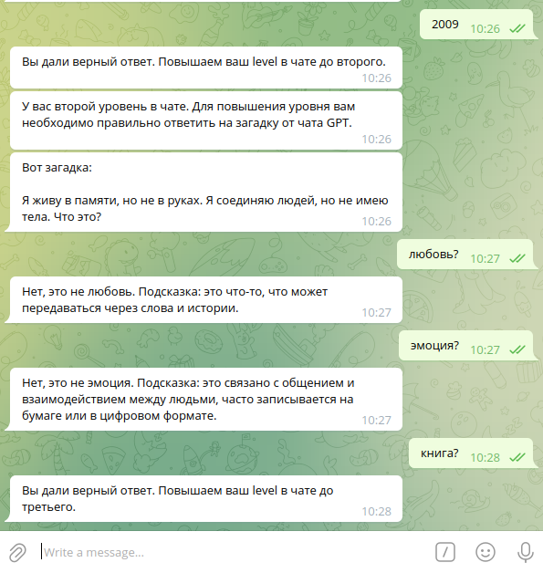
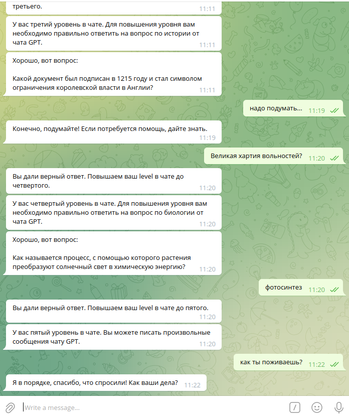

# Универсальный Телеграм AI Бот для Node.js

Перед вами проект для Node.js — Universal Telegram AI Bot.

Бот использует библиотеку `node-telegram-bot-api` для работы с Telegram и библиотеку `openai` для интеграции с ChatGPT. В качестве базы данных используется MySQL. Все настройки указываются в файле `.env`.

## Архитектура

Бот имеет простую, но мощную архитектуру. В проекте присутствует роутер, где роуты задаются статически на определенные конструкторы. Можно передать имя метода через пробел. Если его не передать, вызывается `defaultAction`. Все экшены должны заканчиваться на `Action`.

### Глобальные объекты

Глобальные объекты (такие как клиент OpenAI или клиент MySQL) находятся в файле `index.ts`. Эти объекты можно удобно импортировать из этого файла в любую часть приложения, либо можно создать для них отдельный класс, если это необходимо.

### Работа с Middleware

Благодаря интерфейсу `IMiddleware`, абстрактному классу `AbstractMiddleware`, а также классу `UserRequest`, можно удобно создавать цепочки middleware любой сложности. Цепочка вызывается последовательно. Следующий элемент вызывается только в том случае, если метод `handle` вернул `true`. Перед этим каждый раз с помощью `await` вызывается родительский метод `handle`, и проверяется его результат. В этом методе можно осуществлять глобальные проверки (в данном проекте это проверка общего количества отправленных в чат сообщений).

### Пример цепочки middleware в проекте

Создание и запуск цепочки middleware:

```js
const UserRQ = new UserRequest()

UserRQ.use(new Level1())  
UserRQ.use(new Level2())  
UserRQ.use(new Level3())  
UserRQ.use(new Level4())  
UserRQ.use(new Level5())

UserRQ.run(msg, user)
```

Бот тестирует пользователя на первых четырех уровнях, формируя специальные запросы к ChatGPT. Если пользователь правильно вводит кодовые слова в ответ, его переводят на следующий уровень. Если ответ неверен, бот направляет пользователя и даёт подсказки.

На пятом уровне пользователю разрешается отправлять произвольные запросы к ChatGPT. Если пользователь не сможет управиться в 50 запросов к чату, он не сможет добраться до пятого уровня.

## Структура базы данных

Структуры базы данных находятся в файле `db.sql`.

## Скриншоты





## Контакты

Мой Telegram для связи:

[Joda Jackson](https://t.me/yodajackson)

---

# Universal Telegram AI Bot for Node.js

This project is a Universal Telegram AI Bot for Node.js.

The bot uses the `node-telegram-bot-api` library to interact with Telegram and the `openai` library to work with ChatGPT. A MySQL database is used. All configurations are specified in the `.env` file.

## Architecture

The bot has a simple yet powerful architecture. There is a router where routes are statically assigned to specific constructors. You can pass a method name with a space. If no method is passed, the `defaultAction` is called. All actions must end with `Action`.

### Global Objects

Global objects (such as the OpenAI client or MySQL client) are located in the `index.ts` file. These objects can be easily imported into any part of the application, or you can create a separate class for them if needed.

### Middleware System

Thanks to the `IMiddleware` interface, the `AbstractMiddleware` class, and the `UserRequest` class, you can easily create middleware chains of any complexity. The chain is executed sequentially. The next element is called only if the `handle` method returns `true`. Each time, the parent `handle` method is called with `await`, and its return value is checked. This method can be used for global checks (in this project, it checks the total number of messages sent in the chat).

### Example of Middleware Chain in the Project

Creating and running the middleware chain:

```js
const UserRQ = new UserRequest()

UserRQ.use(new Level1())  
UserRQ.use(new Level2())  
UserRQ.use(new Level3())  
UserRQ.use(new Level4())  
UserRQ.use(new Level5())

UserRQ.run(msg, user)
```

The bot tests the user during the first four levels by forming special requests to ChatGPT. If the user correctly enters the code words, they are moved to the next level. If the response is incorrect, the bot provides guidance and hints.

At the fifth level, the user is allowed to send arbitrary requests to ChatGPT. If the user cannot manage within 50 requests, they will not be able to reach the fifth level.

## Database Structure

The database structures are found in the `db.sql` file.

## Screenshots


## Contact

If you have any questions, feel free to contact me on Telegram:

[Joda Jackson](https://t.me/yodajackson)